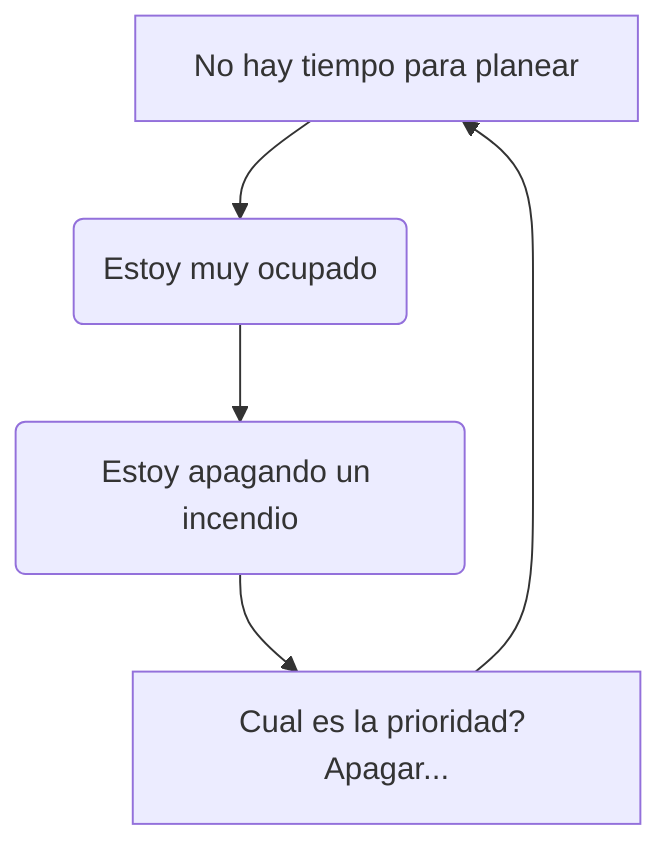

---
tags:
  - master
  - Management
---
La principal misión de un alcance de proyecto es compartir una vision común del proyecto, pero porque existe a veces este vació?

Principalmente porque sucede un circulo vicioso de la planeacion:

Para romper este vicio debemos hacer un *Plan de Dirección de Proyecto* donde construimos los siguientes artefactos:

- Por que
	- Objetivos de negocio
	- Objetivos del proyecto
	- Definición del proyecto
- Que
	- Acta de constitución
	- EDT / Estructura del desglose del trabajo
- Como
	- Paquetes de trabajo
	- Red
- Cuando
	- Diagrama de Gantt
- Cuanto
	- Estimados y plan de costos
	- Recursos y cronogramas
- Quien
	- Matriz de responsabilidades
	- Organigrama

# Gestion del alcance
Incluye los procesos requeridos para asegurar que el proyecto incluya todo el trabajo requerido, y solamente el trabajo requerido, para la terminación exitosa del proyecto, que debe contener:

- Alcance del producto: Características y funciones que caracterizan un producto o servicio
- Alcance del proyecto: El trabajo que tiene que ser ejecutado para la entrega de los productos con sus características y funciones especificas

Para esto podemos hacer uso de un **EDT** (Estructura del desglose del trabajo), que fine la base para la planeacion y define los entregables del proyecto.

- Los entregables pueden ser artefactos o partes del producto final
- Esto se encarga de organizar y define el alcance total del proyecto

De igual manera nos permite:

- Identificar los requerimientos de los recursos (habilidades)
- Realizar estimativos de cuanto dura un trabajo (tiempo)
- Estimar costos fijos

Imagina un carro donde los descomponemos las partes, cada parte es un entregable 