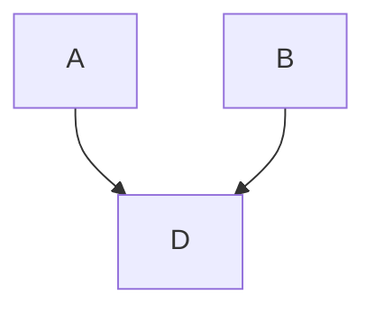

---
tags:
  - master
  - Management
---
Esto consiste en ejecutar los procesos requeridos para asegurar la finalization a tiempo del proyecto:

- Definición de actividades - *lo que se necesita hacer*
- Secuenciar de las actividades - *orden en que las cosas deben ocurrir*
- Estimación de los recursos de las actividades - *recursos necesarios para ejecutar las actividades*
- Desarrollo del cronograma - *crear la hoja de ruta*
- Integración Costo/Cronograma - *el tiempo es dinero*
- Análisis del cronograma - *que nos esta diciendo el cronograma*
- Reporte del desemperno del cronograma - *como lo estamos haciendo y hacia donde vamos*
- Control del cronograma - *manejo los cambios*

# De la EDT al cronograma

Partiendo del EDT realizamos un **diagrama de red** que nos muestra el orden en que las actividades deben ser realizadas basadas en dependencias y/orden, después hacemos basado en dos cosas ***esfuerzo o duracion***

Donde el **esfuerzo** representa el trabajo requerido para realizar una tarea determinada:
- Se puede medir en horas|dias|semanas.../hombre
- Representa el numero total de horas que cada persona gasta ejecutando una tarea

Por otro lado, podemos representarlo en **duración** que representa la cantidad de tiempo entre el inicio y la finalizacion de una tarea
- La duración se mide en horas (o días, semanas, etc.)
- No tiene en cuenta la cantidad de personas que ejecutan la tarea

>[!NOTE]
>Siempre debemos ver la relación que hay entre esfuerzo y duración

Tenemos varios tipos de dependencias:
- **FIN** a **INICIO**
	- Hasta que T1 no termine, T2 no arranca
- **INICIO** a **INICIO**
	- Hasta que T1 no inicie, T2 no inicia
- **FIN** a **FIN**
	- Hasta que T1 no termine, T2 no termina
- **INICIO** a **FIN**
	- Hasta que T1 que no inicie, T2 no termina

# Elaboración del diagrama de red
- Red de actividades en nodos (AON)
	- Enfoque en actividades

Un nodo se representa de la siguiente manera

| 12 Fecha de inicio temprana       |                                | 22 Fecha de finalizacion temprana |
| --------------------------------------- | ------------------------------ | --------------------------------------- |
| 2 Holgura                            | A Actividad                 | 2 Holgura                            |
| 14 Fecha de finalizacion temprana | 10 Duración de la actividad | 24 Fecha de finalizacion tardia   |
# Puntos importantes
- Las actividades criticas forman la **ruta critica**
- La ruta critica es la trayectoria **mas larga** a través de la red
- Puede existir mas de una **ruta critica**
- Cualquier retraso en una actividad critica automáticamente retrasa el proyecto
- Si se retrasa una actividad no criticas mas de sus holgura, el proyecto se retrasa

> Ver aca el [tutorial](https://view.genially.com/65394c6f7c0a0b00116ca338)

